# Breast Cancer Survival Prediction using Apache Spark MLlib

An end-to-end machine learning pipeline for predicting breast cancer patient survival status using the SEER Research Database and Apache Spark MLlib.

---


---

## 1. Project Overview

Breast cancer is one of the most common cancers worldwide and remains a major cause of cancer-related mortality. Accurate identification of high-risk patients can support treatment planning, patient monitoring, and clinical decision-making.

This project develops an end-to-end machine learning pipeline to predict breast cancer patient survival status using clinical data from the SEER (Surveillance, Epidemiology, and End Results) Research Database.

The system applies Apache Spark MLlib for large-scale data processing and machine learning, covering the complete workflow from data preprocessing, feature engineering, model training, evaluation, threshold optimization, and clinical error analysis.

---

## 2. Research Objectives

The main objective of this project is to develop a scalable machine learning system capable of predicting breast cancer patient survival status based on clinical characteristics.

The prediction task is formulated as a **binary survival status classification problem**.

Key project milestones include:

- Processing large-scale cancer registry data using **Apache Spark**.
- Designing an effective **Feature Engineering pipeline** tailored for oncological variables.
- Handling class imbalance using **class weighting (`weight`)**.
- Comparing multiple classification algorithms.
- Optimizing prediction thresholds for classification performance analysis.
- Interpreting model decisions and misclassifications (**False Positives** & **False Negatives**) using explainable machine learning techniques.

---

# 3. Dataset Description

## Data Source

- **Database:** SEER Research Database (National Cancer Institute - NCI)
- **Dataset Submission:** *Incidence - SEER Research Data, 17 Registries, Nov 2025 Sub (2000–2023)*

## Cohort Selection Criteria

- **Cancer Site:** Breast Cancer (Site recode ICD-O-3/WHO 2008)
- **Diagnosis Period:** 2004 - 2015

## Target Variable

The prediction target is derived from the patient's vital status.

| Variable | Description |
|---|---|
| `label = 0` | Alive / Survived at last follow-up |
| `label = 1` | Dead / Deceased |

### Note

`Survival_Months` is not used as a predictive feature in this classification pipeline.

The current project focuses on **binary survival status prediction**, while time-to-event survival modeling will be considered as a future extension.

---

# 4. System Architecture

The proposed system consists of six major stages:

```text
+-----------------------+     +-----------------------+     +-----------------------+
|  1. Data Collection   | --> | 2. Data Preprocessing | --> |3. Feature Engineering |
|     (SEER Database)   |     | (Cleaning & Casting)  |     |  (Derived Features)   |
+-----------------------+     +-----------------------+     +-----------------------+
                                                                        |
                                                                        v
+-----------------------+     +-----------------------+     +-----------------------+
|6. Model Interpretation| <-- |  5. Model Evaluation  | <-- | 4. ML Model Training  |
|  (Error Analysis)     |     | (Metrics & Threshold) |     |     (Spark MLlib)     |
+-----------------------+     +-----------------------+     +-----------------------+
```
---
## 5. Data Processing & Feature Engineering

### Data Preprocessing

The preprocessing stage prepares raw SEER data for machine learning modeling through several essential steps:

- Handling missing values and standardizing SEER special codes (e.g., Unknown, 999).
- Converting data types and standardizing the Spark DataFrame schema.
- Removing duplicate records and applying cohort selection criteria.
- Producing clean datasets for downstream feature engineering and model training.

<!-- Ảnh phân bố tuổi theo trạng thái sống/chết -->
<p align="center">
  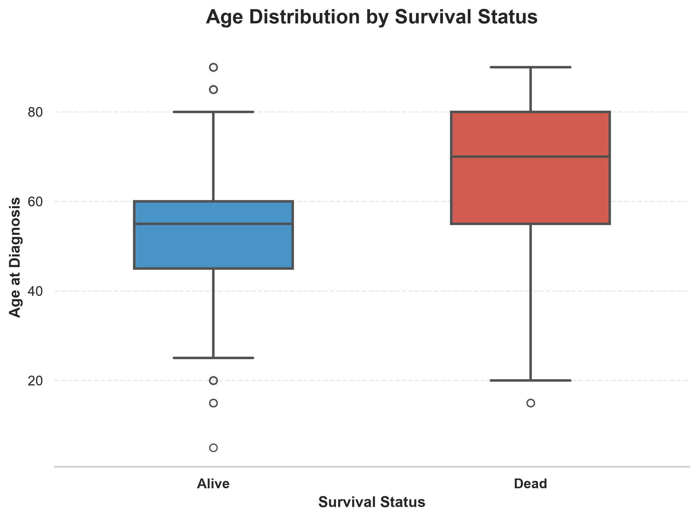
  <br>
  <i>Hình 1: Biểu đồ Boxplot phân bố tuổi theo trạng thái sống/chết (Alive/Dead)</i>
</p>

### Feature Engineering

To improve predictive performance, several clinically meaningful features were constructed.

#### Node_Ratio

Ratio between positive regional lymph nodes and examined regional lymph nodes.

**Formula**

```text
Node_Ratio = Regional_Nodes_Positive / Regional_Nodes_Examined
```

This feature reflects the severity of lymph node involvement and disease progression.

#### Hormone_Status

Composite biomarker derived from Estrogen Receptor (ER) and Progesterone Receptor (PR) status.

Possible categories:

- HR_Positive
- HR_Negative
- HR_Mixed
- Unknown

#### Clinical Features

The following variables were retained as important clinical predictors:

- Age at diagnosis
- Tumor Size
- AJCC Stage
- Histologic Grade
- Regional Lymph Node Information
- Treatment Variables (Surgery, Radiation, Chemotherapy)

#### Class Weighting

Inverse class frequency weighting was applied to reduce the impact of class imbalance.

The generated `weight` column was used during model training.

```python
GBTClassifier(weightCol="weight")
```

---

### Feature Summary

| Feature Group | Features Included |
|---|---|
| **Demographics** | `Age`, `Sex`, `Race`, `Marital_Status` |
| **Tumor Characteristics** | `Tumor_Size`, `AJCC_Stage`, `AJCC_T`, `AJCC_N`, `AJCC_M`, `Grade`, `Histologic_Type` |
| **Lymph Node Status** | `Regional_Nodes_Examined`, `Regional_Nodes_Positive`, `Node_Ratio` |
| **Biomarkers & Treatment** | `Hormone_Status`, `Surgery_Primary_Site`, `Surgery_Other_Regional`, `Surgery_Radiation_Sequence`, `Radiation`, `Chemotherapy` |

--- 

## 6. Machine Learning Models

Four classification algorithms were trained and evaluated using **Apache Spark MLlib Pipelines**.

| Model | Description |
|-------|-------------|
| **Logistic Regression** | Baseline linear classifier with class weighting |
| **Decision Tree** | Rule-based non-linear classifier |
| **Random Forest** | Ensemble tree-based bagging classifier |
| **Gradient Boosted Trees (GBT)** | Sequential boosting-based classifier with the best predictive performance |

---

## 7. Experimental Results

The models were evaluated using standard classification metrics and computational efficiency.

| Model                  |   Accuracy |  Precision |     Recall |   F1-score |    ROC-AUC | Training Time (s) |
| ---------------------- | ---------: | ---------: | ---------: | ---------: | ---------: | ----------------: |
| Logistic Regression    |     0.7782 |     0.7818 |     0.7782 |     0.7796 |     0.8433 |             54.03 |
| Random Forest          |     0.7592 |     0.7679 |     0.7592 |     0.7617 |     0.8326 |             21.39 |
| Decision Tree          |     0.7792 |     0.7791 |     0.7792 |     0.7791 |     0.5532 |             15.09 |
| Gradient Boosted Trees | **0.7866** | **0.7886** | **0.7866** | **0.7874** | **0.8560** |         **82.89** |

<!-- Ảnh so sánh ROC-AUC -->
<p align="center">
  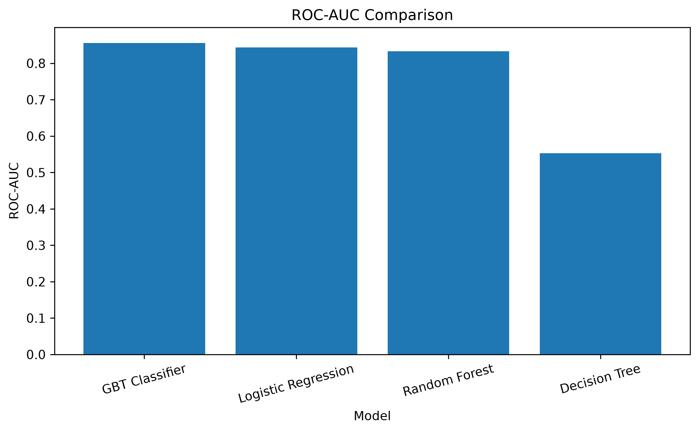
  <br>
  <i>Hình 2: So sánh đường cong ROC-AUC giữa các mô hình</i>
</p>

<!-- Ảnh đường cong ROC & Precision-Recall -->
<p align="center">
  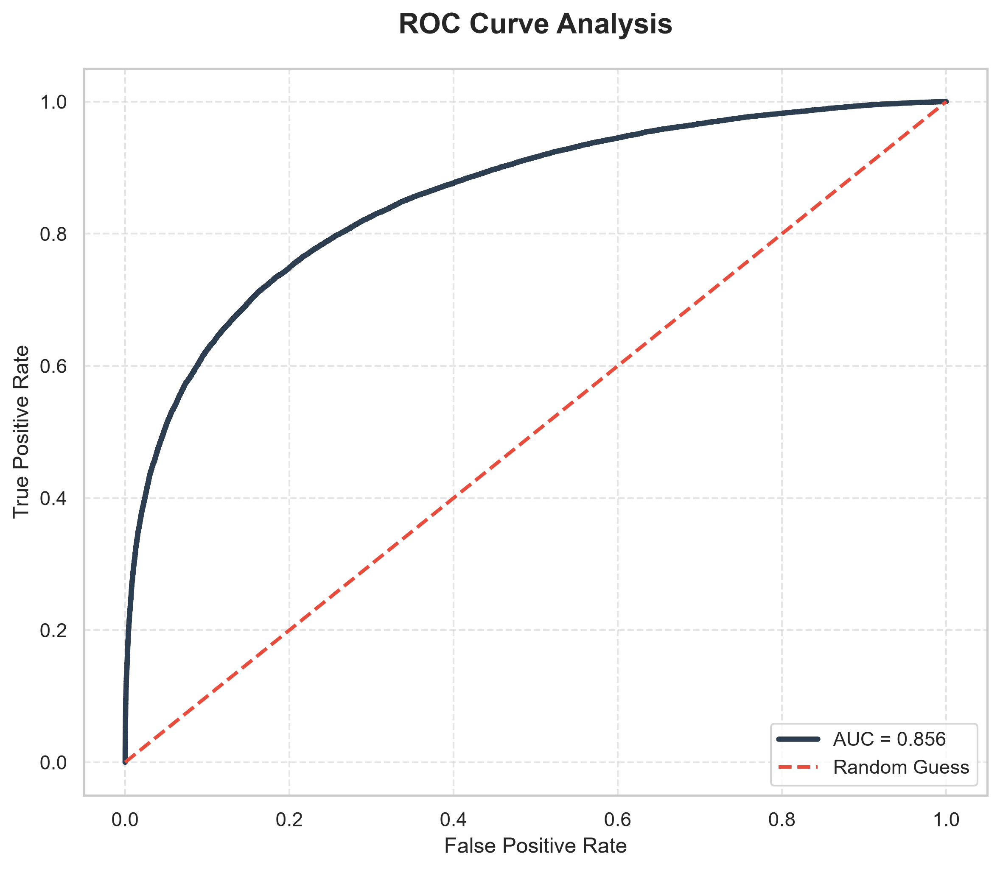
  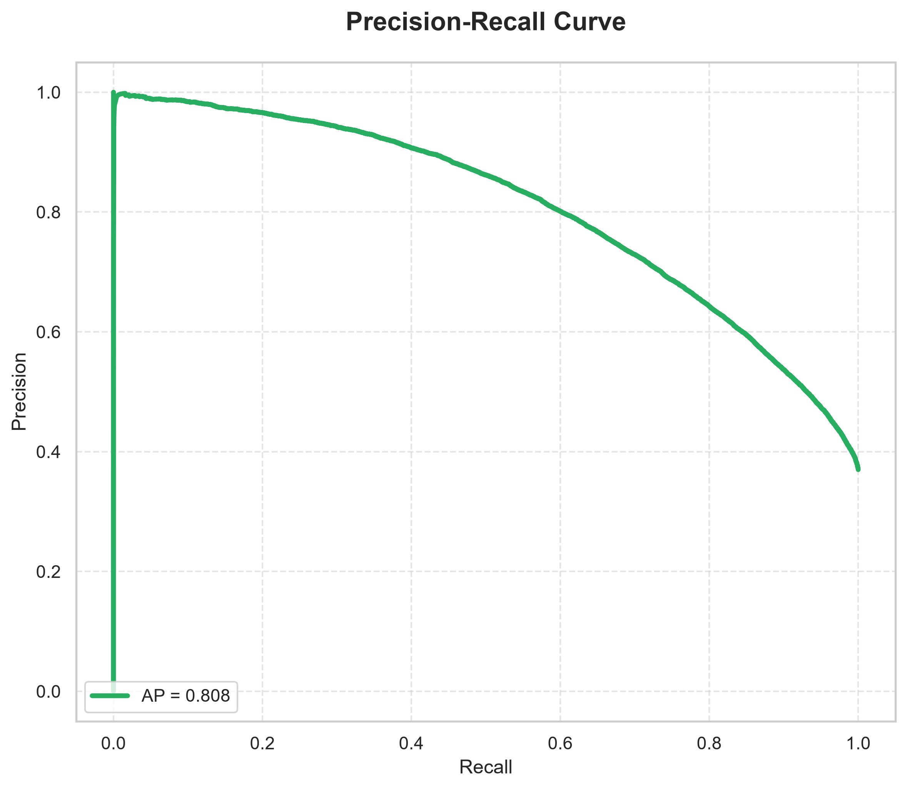
  <br>
  <i>Hình 3: Đường cong ROC và Precision-Recall của mô hình Gradient Boosted Trees</i>
</p>

> **Key Finding:**  
> The Gradient Boosted Trees (GBT) classifier achieved the best overall performance based on ROC-AUC and F1-score, making it the selected model for feature interpretation and clinical error analysis.

---
## 8. Threshold Optimization

To investigate the impact of different decision thresholds, the best-performing GBT model was evaluated at multiple probability thresholds.

| Threshold | Accuracy | Precision | Recall | F1-score |
|----------:|---------:|----------:|--------:|---------:|
| 0.35 | 0.7378 | 0.6051 | **0.8387** | 0.7030 |
| 0.40 | 0.7590 | 0.6384 | 0.8040 | 0.7117 |
| 0.45 | 0.7755 | 0.6721 | 0.7677 | 0.7167 |
| **0.50** | **0.7866** | **0.7038** | 0.7310 | **0.7172** |


<!-- Ảnh phân tích ngưỡng tối ưu -->
<p align="center">
  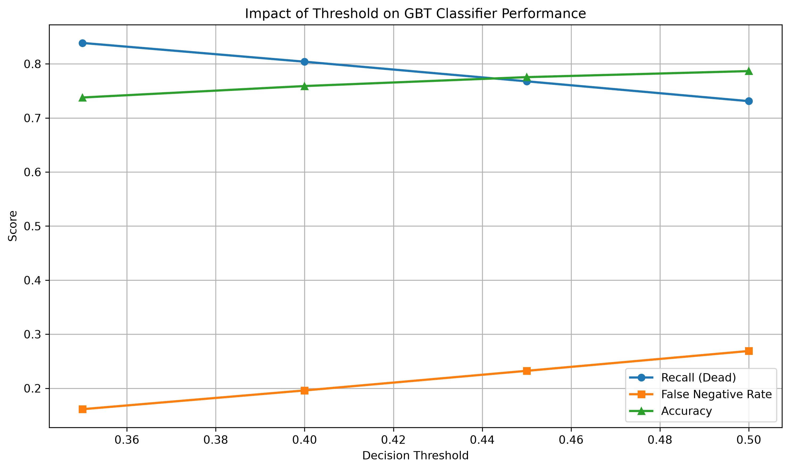
  <br>
  <i>Hình 4: Biểu đồ phân tích chọn ngưỡng tối ưu cho mô hình dự đoán</i>
</p>

Lower thresholds improve recall by identifying more high-risk patients but increase the number of false positives. The default threshold (0.50) provides the best overall balance between precision and F1-score.

---

## 9. Model Interpretation & Misclassification Analysis

To improve model transparency, the best-performing GBT model was further analyzed using feature importance and prediction error analysis.

### Feature Importance

<!-- Ảnh Top 20 và Nhóm đặc trưng quan trọng -->
<p align="center">
  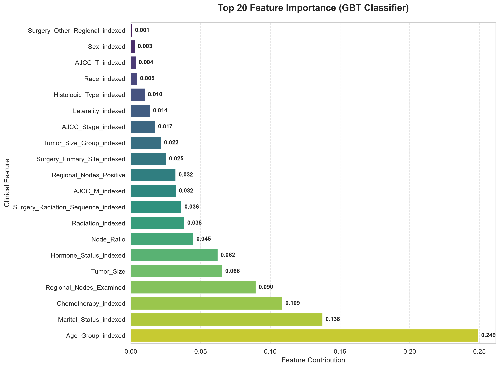
  <br>
  <i>Hình 5: Top 20 đặc trưng quan trọng nhất đối với mô hình GBT</i>
</p>

<p align="center">
  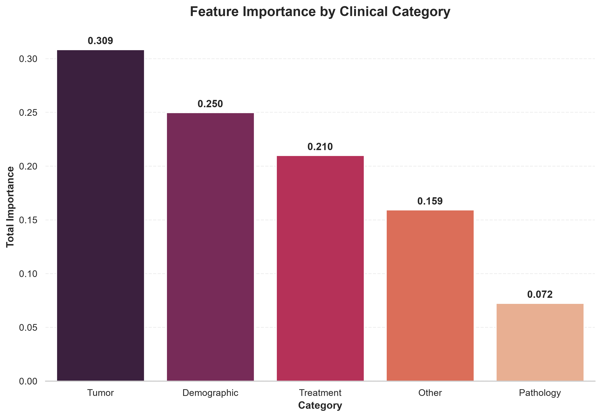
  <br>
  <i>Hình 6: Mức độ quan trọng tích lũy theo từng nhóm đặc trưng lâm sàng</i>
</p>

The most influential predictors include:

1. **Node_Ratio** and **Rgegional_Nodes_Positive**
   - Indicators of lymph node involvement and disease spread.

2. **Age**
   - Represents baseline mortality risk.

3. **Tumor_Size** and **AJCC_Stage**
   - Reflect anatomical tumor progression.

4. **Hormone_Status** and Treatment Variables
   - Capture biological subtype and therapeutic information.


### Prediction & Confidence Distribution

<!-- Ảnh tỉ lệ dự đoán đúng/sai và phân bố độ tin cậy -->
<p align="center">
  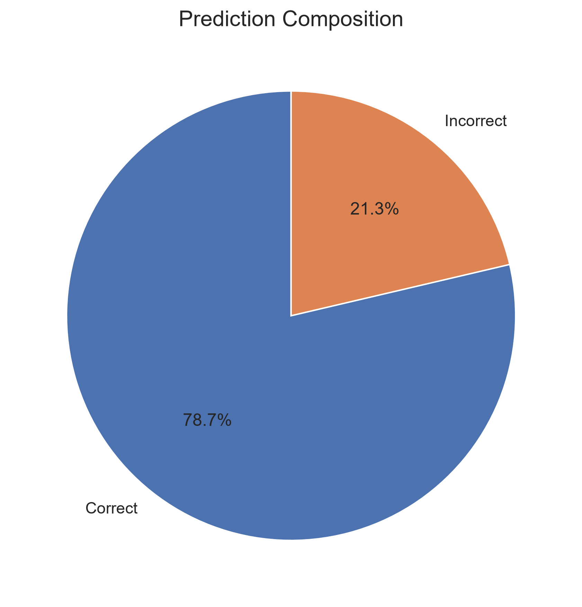
  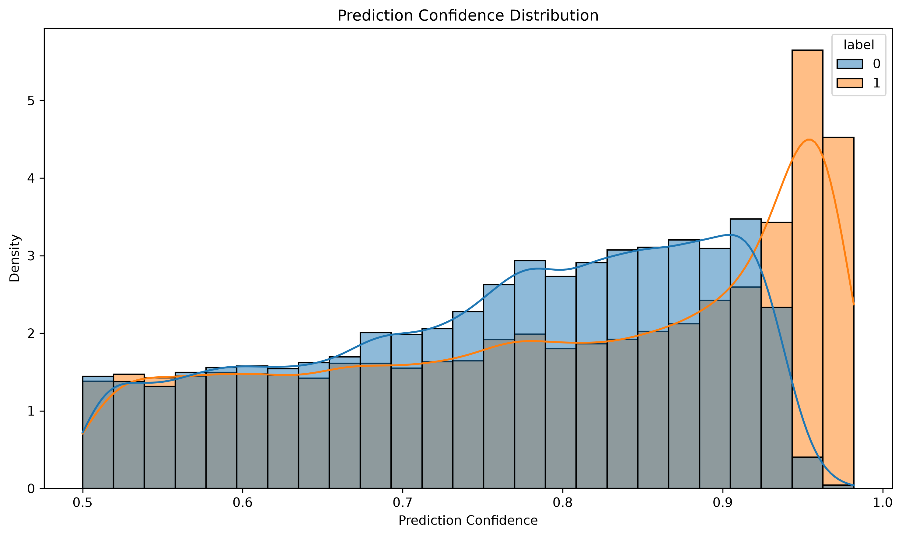
  <br>
  <i>Hình 7: Biểu đồ tròn tỉ lệ dự đoán đúng/sai và Phân bố độ tin cậy của dự đoán</i>
</p>

---

### Misclassified Sample Analysis

Prediction errors were investigated using False Negative (FN) and False Positive (FP) cases.

<!-- Ảnh Ma trận nhầm lẫn & Biểu đồ đếm lỗi -->
<p align="center">
  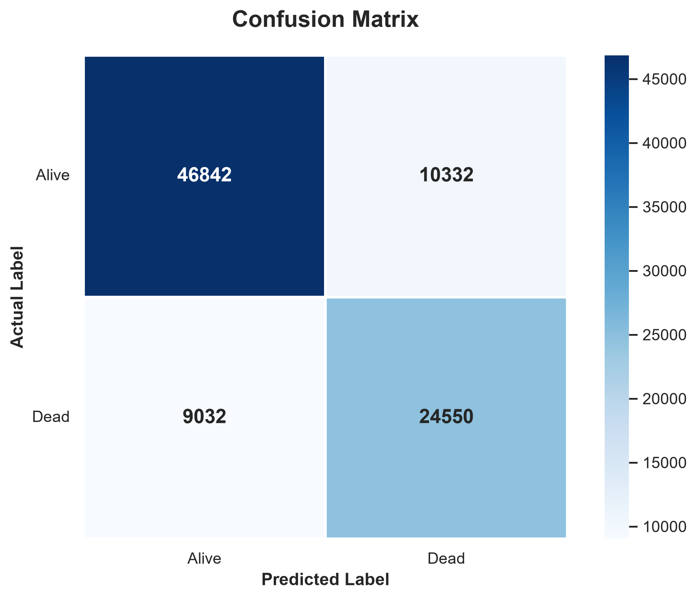
  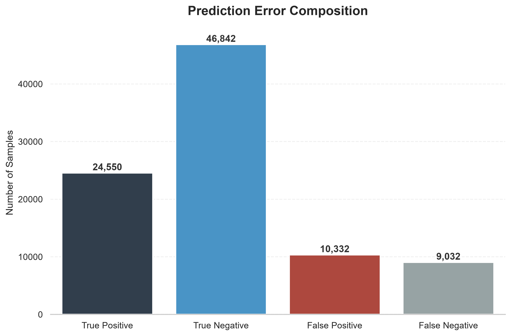
  <br>
  <i>Hình 8: Ma trận nhầm lẫn (Confusion Matrix) và Biểu đồ đếm lỗi phân loại</i>
</p>

<!-- Ảnh So sánh đặc trưng lâm sàng của các nhóm lỗi -->
<p align="center">
  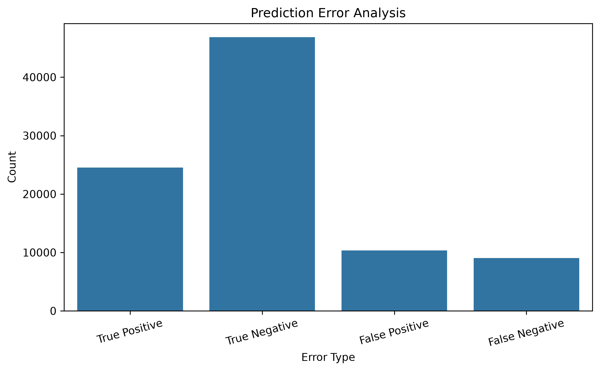
  <br>
  <i>Hình 9: So sánh đặc trưng lâm sàng giữa các nhóm phân loại đúng và sai</i>
</p>

| Error Type | Definition | Cases | Avg. Age | Avg. Tumor Size (mm) | Avg. Positive Nodes | Avg. Node Ratio |
|------------|-----------|------:|---------:|---------------------:|--------------------:|----------------:|
| False Negative | Predicted Alive, Actual Dead | 9,032 | 54.67 | 21.84 | 0.77 | 0.096 |
| False Positive | Predicted Dead, Actual Alive | 10,332 | 64.10 | 28.78 | 2.21 | 0.184 |


### Clinical Insights

#### False Negative (FN)

Patients predicted as **Alive** but actually **Dead** generally exhibited relatively favorable clinical characteristics:

- Average age: **54.67 years**
- Average tumor size: **21.84 mm**
- Average positive lymph nodes: **0.77**
- Average Node_Ratio: **0.096**

These findings suggest that mortality may be influenced by biological factors unavailable in the SEER dataset.
These observations demonstrate that the proposed model learns clinically meaningful patterns rather than relying solely on statistical correlations.

#### False Positive (FP)

Patients predicted as **Dead** but actually **Alive** generally presented more advanced disease characteristics:

- Average age: **64.10 years**
- Average tumor size: **28.78 mm**
- Average positive lymph nodes: **2.21**
- Average Node_Ratio: **0.184**

These patients may have benefited from treatment response, clinical management, or other prognostic factors not captured in the available data.

---

## 10. Project Structure

```text
Project_Breast_Cancer_SEER/
│
├── data/
│   ├── raw/
│   ├── interim/
│   └── processed/
│
├── models/
│   └── trained_models/
│       ├── logistic_regression_model/
│       ├── decision_tree_model/
│       ├── random_forest_model/
│       └── gbt_classifier_model/
│
├── notebooks/
│   ├── 01_Data_Exploration.ipynb
│   ├── 02_Data_Preprocessing.ipynb
│   ├── 03_Feature_Engineering.ipynb
│   ├── 04_Model_Training.ipynb
│   ├── 05_Model_Evaluation.ipynb
│   └── 06_Model_Interpretation.ipynb
│
├── reports/
│   ├── figures/
│   └── tables/
│
├── src/
│   ├── data/
│   ├── features/
│   ├── models/
│   └── utils/
│
└── docs/
    ├── proposal/
    ├── report/
    └── data_dictionary/
```

---
## 11. Technologies Used

| Category             | Technology           |
| -------------------- | -------------------- |
| Language             | Python 3.11          |
| Framework            | Apache Spark 3.5.6   |
| Machine Learning     | Spark MLlib          |
| Java                 | OpenJDK 17           |
| Visualization        | Matplotlib, Seaborn  |
| Scientific Computing | NumPy, Pandas, SciPy |
| Notebook             | JupyterLab           |
| Development          | Git, GitHub, VS Code |

---

## 12. Future Improvements

- Extend the study using more recent SEER releases.
- Deploy the pipeline on a distributed Spark cluster.
- Evaluate advanced boosting algorithms such as XGBoost4J-Spark and LightGBM.
- Develop an interactive web-based clinical decision support application.
- Incorporate deep learning and explainable AI techniques (SHAP/LIME).
- Integrate multimodal data (medical imaging and genomic biomarkers).

---

## 13. Conclusion

This project presents a scalable machine learning framework for breast cancer survival prediction using Apache Spark MLlib. By combining large-scale data preprocessing, clinically meaningful feature engineering, class weighting, and ensemble learning, the proposed pipeline achieved strong predictive performance.

Beyond predictive accuracy, feature importance analysis and clinical error analysis provide valuable insights into model behavior, contributing to the development of more transparent and reliable AI-assisted decision support systems in healthcare.

---

## Author

**Jiin Hoàng**

Final-Year Data Science Student

Nguyen Tat Thanh University (NTTU)

GitHub:
https://github.com/JinxX111/Breast-Cancer-Survival-Prediction
